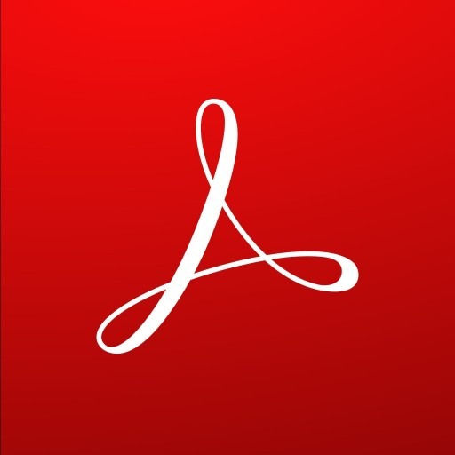
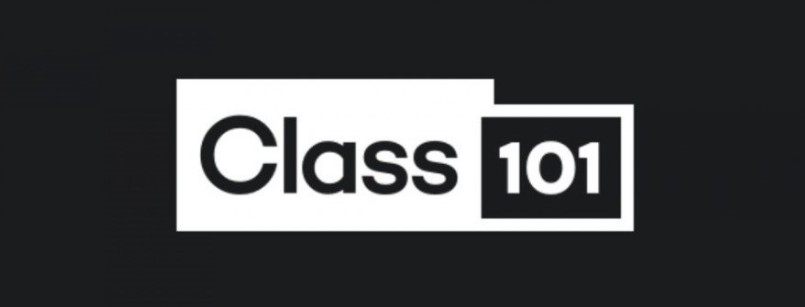

# jungkihun

안녕하세요 저는 대한민국에 살고 있는 백엔드 개발자 정기훈입니다.

Hello, I'm Jung Ki Hun and I live in South Korea.

프로젝트 하는 걸 좋아하고 Node.js에 관심이 많습니다.

I like to do projects and I am very interested in Node.js.

또한 vue.js를 활용한 프론트엔드 기술에 관심이 많이 있습니다.

I am also very interested in front-end technology using vue.js.

유튜브 채널을 운영하고 있고 저에게 문의 사항이 있을경우 이메일로 연락주세요 !!!

I run a YouTube channel and if you have any questions for me, please contact me by e-mail !!!

 

 
 
 
 
 
 

# 교육사항
인제대 / 컴퓨터공학과 공학사 2016.3 ~ 2022.02(6 years)

- 제1회 동남권 바이오클러스터 AI교육 - 수료
- 비정형 의료/건강 데이터를 활용한 기계학습 이론과 실습 - 수료
- 패스트 캠퍼스 알고리즘 강의 - 수료
<!-- - nhn 아카데미 웹개발자 코스 -->

 
## Tool

<!-- ### etc
- Rhinoceros 5
- Adobe XD -->

# 경력사항
 포켓컴퍼니 
 
 2022.5 ~
 <!-- - 라이더 어플 개발참여
 - 커뮤니티 어플 개발참여 -->
 
# 대외활동 및 프로젝트 참여 이력
## <a href= "./프로젝트.md"> 프로젝트 참여 이력</a>
<!-- ### 2016년도 
- 웹프로그래밍 수업 - asp.net 기반 웹서비스 개발
### 2019년도 
- 제어프로그래밍 수업 - 아두이노를 활용한 블루투스 2d프린터
- 자바프로그래밍2 수업 - 소캣통신 기반의 채팅프로그램 
- 유니티 게임 프로젝트 - 클리커 게임 project eco
### 2020년도 
- 캡스톤 디자인 - 웹기반 IoT 공기청청기 시스템
- 고급시스템프로그래밍 수업 - wpf를 활용한 카드 뒤집기 
### 2021년도 
- 졸업작품 - web기반 ERP시스템과 무인 iot 자동차
- 인제간단하죠 교육기부 동아리 운영 시스템 개발
- 뉴스 데이터 분석 프로그래밍
- node.js npm 모듈개발(any-function)
### 2022년도 -->

## <a href = "./대외활동.md">대외활동</a>
<!-- ### 2016년도
- 교내 학술동아리 맨토 맨티 활동
### 2020년도 
- 하반기 온라인 교육기부 활동
- 학술동아리 c언어 세미나
- it 정보공유용 디스코드 운영
- 부산 지역 node.js 스터디 활동
### 2021년도
- 2021년 여름방학 교육기부 쏙쏙캠프
- 학술동아리 git 세미나 진행
- 경남ICT 제 1회 소프트웨어 경진대회 - 장려상
- 2021 INJE 캡스톤디자인 경진대회 참여
- 인프런 강의 업로드
- 클래스101 원포인트 강좌 생성
### 2022년도
- nhnh 웹 서비스 개발 부트캠프 -->

<!-- # 자격증
- 컴퓨터 활용능력 2급
- itq(파워포인트 엑셀 아래한글) -->
